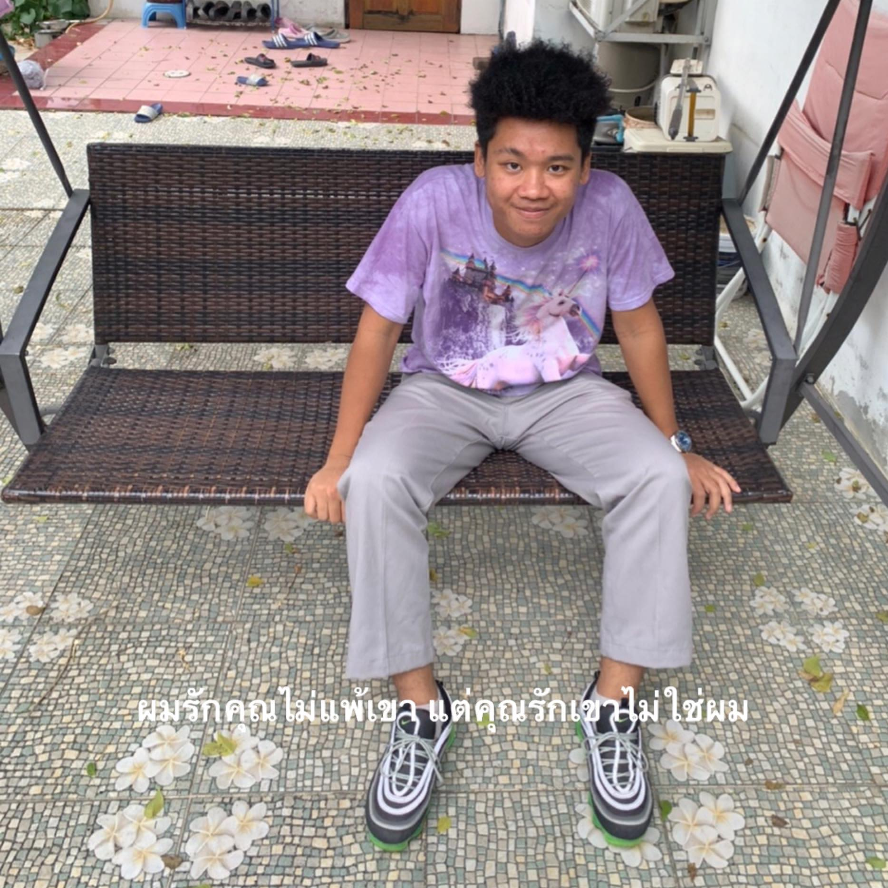

# Smart-Bin
<li>This is a Project for computer programming 06016315</li>
<li>โปรเจคนี้ เป็นส่วนหนึ่งของรายวิชา คอมพิวเตอร์โปรแกรมมิ่ง 06016315</li>
<li>link Video - <a href="https://youtu.be/w9u8aTOCDFY">https://youtu.be/w9u8aTOCDFY</a>  </li>

## Abstract
&emsp;ปัจจุบันผู้คนส่วนใหญ่ต้องการความสะดวกสบายในการใช้ชีวิตกันเป็นอย่างมาก  โครงงานนี้จึงถูกพัฒนาขึ้นเพื่ออำนวยความสะดวกให้กับผู้ใช้งาน มีระบบเซ็นเซอร์ตรวจวัดระยะเมื่อยื่นขยะออกไปเพื่อจะทิ้ง หากอยู่ในระยะที่ระบบตรวจจับได้ฝาของถังขยะจะเปิดขึ้นอัตโนมัติ  ทำให้ถังขยะธรรมดาๆเปลี่ยนเป็นถังอัจฉริยะที่สามารถ 
เปิด-ปิดได้ด้วยตัวของมันเอง ทำให้ผู้ใช้งานหมดปัญหาที่จะก้มไปเปิดฝาถังขยะ

## Required Components
<table>
<thead>
<tr>
<th align="center">Servo Motor Arduino SG90 motor Servo ขนาดเล็ก</th>
<th align="center">Arduino Uno R3+USB Arduino Uno</th>
<th align="center">Ultrasonic SR04 เซนเซอร์ UltrasonicModule HC-SR04 Distance Measuring Transducer Sensor</th>
</tr>
</thead>
<tbody>
<tr>
<td align="center"></td>
<td align="center"></td>
<td align="center"></td>
</tr>
</tbody>
</table>
<table>
<thead>
<tr>
<th align="center">Jumper Wire (Male to Female)</th>
</tr>
</thead>
<tbody>
<tr>
<td align="center"></td>
</tr>
</tbody>
</table>

## Library in Use
<ul>
<li>Servo.h</li>
</ul>

# Poster

## Group Members
&nbsp;&emsp;&emsp;&emsp;&nbsp;&nbsp; 
&emsp;&nbsp;&nbsp;&nbsp;|[th4it4y4](https://github.com/th4it4y4)|&emsp;&emsp;&emsp;&emsp;&emsp;&emsp;&nbsp;|[Supertee003](https://github.com/Supertee003)| |Nitichai Kodchatean|&emsp;&emsp;|Teerawat Donse| 
&emsp;&nbsp;|61070104|&emsp;&emsp;&emsp;&emsp;&nbsp;&nbsp;&nbsp;&nbsp;&nbsp;&nbsp;&emsp;|61070092|

## Special Thanks
<table>
<thead>
<tr>
<th align="center"></a></th>
<th align="center"></a></th>
</tr>
</thead>
<tbody>
<tr>
<td align="center"> Asst Profressor Kitsuchart Pasupa ผศ. ดร. กิติ์สุชาต พสุภา</td>
<td align="center"> Asst Profressor Panwit Tuwanut ผศ. ดร. ปานวิทย์ ธุวะนุติ</td>
</tr>
</tbody>
</table>
